# 软工复习资料
 ***声明本仓库仅用于个人复习用途，严禁作为其他用途使用，由此带来的后果与本人无关***
### 软件的本质特性

<pre>
1.复杂特性  
2.抽象特性  
3.依赖特性  
4.使用特性
5.废弃特性
6.应用特性</pre>

  
### 软件危机的表现形式

<pre><code>
1.软件开发费用和进度失控  
2.软件系统实现的功能与实际需求不符  
3.软件的可靠性差  
4.软件难以维护  
5.软件通常没有适当的文档资料
6.软件成本在计算机系统总成本中所占的比例居高不下，且逐年上升
7.软件生产率提交的速度，远远跟不上计算机应用迅速普及深入的趋势</code></pre>

### 软件生存周期各个阶段的任务
3个时期:  

<pre><code>1.软件定义时期
2.软件开发时期
3.软件维护时期</code></pre>

8个阶段:  

<pre><code>1.问题定义
2.可行性研究
3.需求分析
4.概要设计
5.详细设计
6.软件实现和单元测试
7.综合测试
8.运行维护</code></pre>

### 软件过程模型
#### 1.瀑布模型

<pre><code>
适用于在软件需求比较明确，开发技术比较成熟，工程管理比较严格的场合下使用  
优点：1.可强迫开发人员采用规范化的方法
2.严格定义了每个阶段必须提交的文档
3.要求每个阶段交出所有的产品都必须是经过验证的  
缺点：1.可能导致最终开发出的软件产品不能真正满足用户需要
2.只适用于项目开始时需求已经确定的情况</code></pre>

  

#### 2.快速原型模型

<pre>
<code>
不带反馈环  
优点：1.有助于满足用户的真实需求
2.略，太长了应该不会出
3.....
</code></pre>

#### 3.增量模型

<pre>
<code>能够在较短的时间内向用户提交一些有用的工作产品</code></pre>

#### 4.螺旋模型

<pre>
<code>螺旋模型可以看做是在每个阶段之前都增加了风险分析过程的快速原型模型</code></pre>

#### 5.喷泉模型

<pre>
<code>
喷泉模型是典型的面向对象软件开发模型</code></pre>

### 可行性研究

<pre>
<code>
1.技术可行性
2.经济可行性
3.社会因素方面的可行性
4.操作可行性</code></pre>

### 数据流图

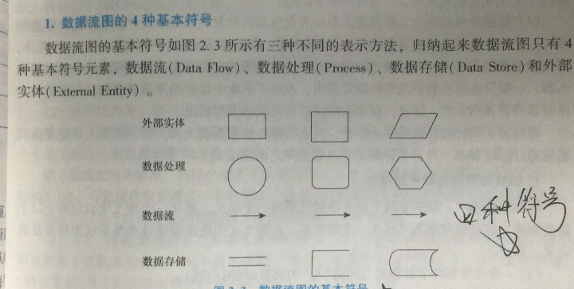

### 数据字典

<pre>
<code>
定义：数据字典是为数据流图中的每个数据流、数据存储、数据处理以及组成数据流或文件的数据项作出说明
内容：数据字典通常由数据元素、数据流、数据存储、数据处理4类条目组成
符号意义：
=：表示“等价于”或“定义为”
+：表示“和”，连接两个数据元素
[]：表示“或”
{}：表示“重复”
()：表示“可选”
</code></pre>

### 各阶段修复软件问题成本变化趋势
阶段越往后，成本越高

### 需求分析的步骤

<pre>
<code>
1.需求获取
2.分析建模
3.需求描述
4.需求验证</code></pre>

### ER图

<pre>
<code>
组成元素：
1.数据对象（实体用方框表示）
2.属性（属性用椭圆表示）
3.联系（关系用菱形表示）
</code></pre>

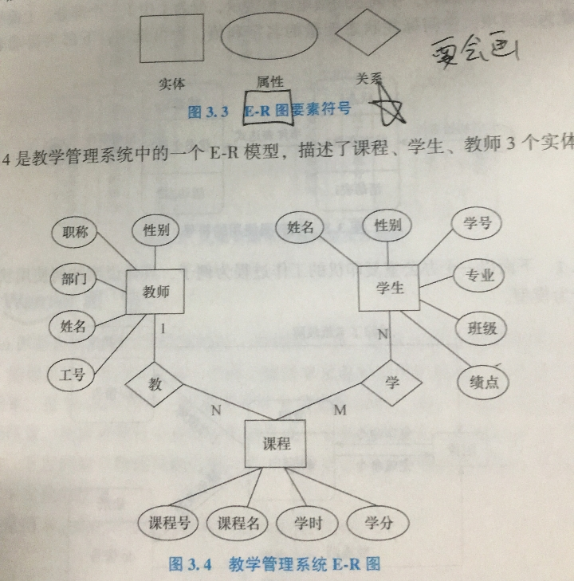

### 层次方框图

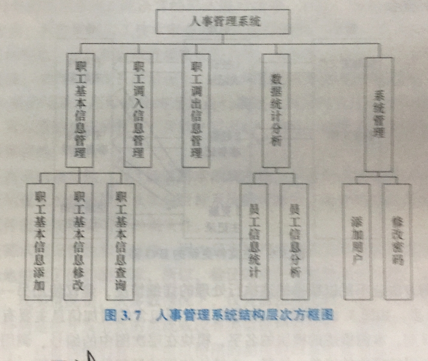

### Warnier图

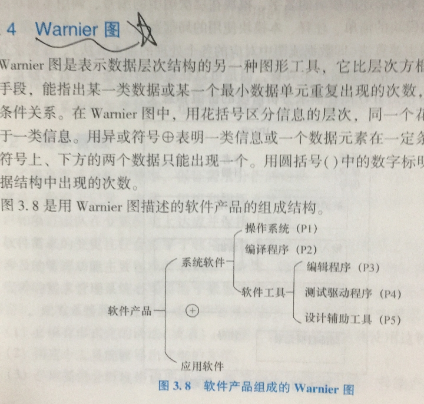

### IPO图

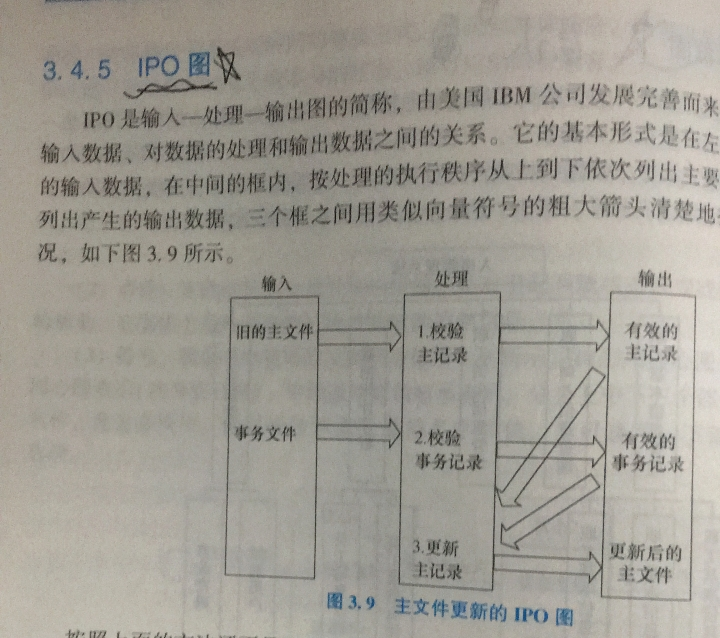

### 分析模型到设计模型的映射

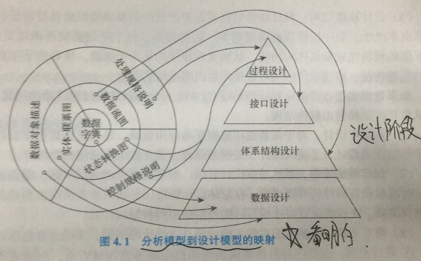

### 模块独立(内聚和耦合)

<pre>
<code>
耦合性越低，独立性越强
内聚性越高，独立性越强</code></pre>

### 层次图

### HIPO图

<code>层次图加上 输入-处理-输出</code>

### 结构图

<pre>
<code>
空心圆传递的是数据
实心圆传递的是控制信息</code></pre>

### 程序流程图

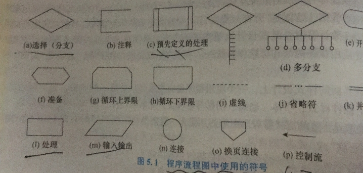
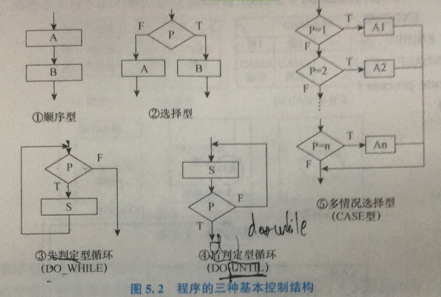

### 盒图

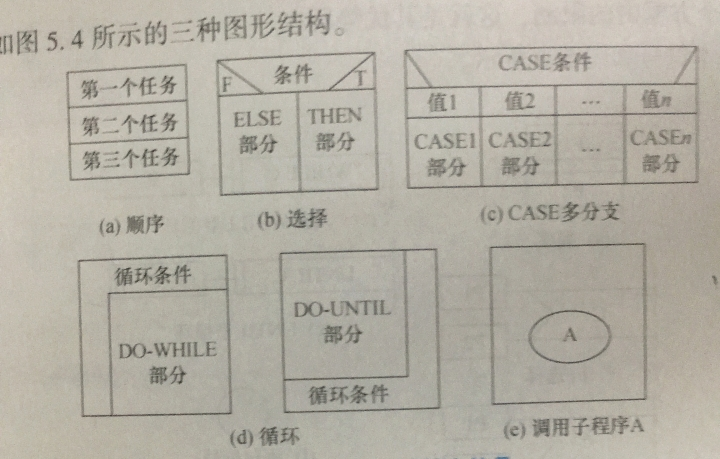

### PAD图

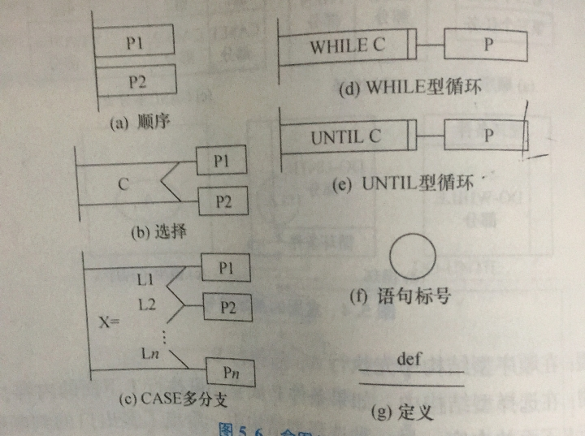

### McCabe方法

<pre>
<code>
环形复杂度V(G)的计算：
V(G)=区域数
V(G)=P(判定节点数)+1
V(G)=E(边数)-N(节点数)+2
</code></pre>

### 程序设计风格

<pre>
<code>
1.源程序文档化
    1)程序的注释分为 序言性注释 和 功能性注释
2.数据说明的方法
3.语句结构
4.输入输出方法</code></pre>

### 白盒测试

<code>
白盒测试又称为结构测试或逻辑驱动测试，指通过对程序内部结构的分析，检测来寻找问题。白盒测试把程序看成装在一个透明的白盒子里，也就是清楚了解程序结构和处理过程，检查所有的结构及路径都是正确的，检查软件的内部动作是否按照设计说明的规定正常进行。
</code>

### 黑盒测试

<code>
黑盒测试又称为功能测试或数据驱动测试，指通过软件的外部表现来发现缺陷和错误，黑盒测试把测试对象看成一个黑盒子，完全不考虑程序内部的结构和处理过程，测试者仅依据程序功能的需求规范考虑，确定测试用例和推断测试结果的正确性，它是站在使用软件或程序的角度，从输入数据与输出数据的对应关系出发进行的测试、
</code>

### 灰盒测试

<code>
介于白盒测试和黑盒测试之间的测试方法，他关注输出对与输入的正确性，同时也关注内部表现，但是不像白盒测试那样详细完整。只是通过一些表征性的现象，事件和标志来判断内部的运行状态
</code>

### 按测试过程分类

<pre>
<code>
1.单元测试
2.集成测试
3.系统测试
4.验收测试
</code></pre>

### 等价类划分

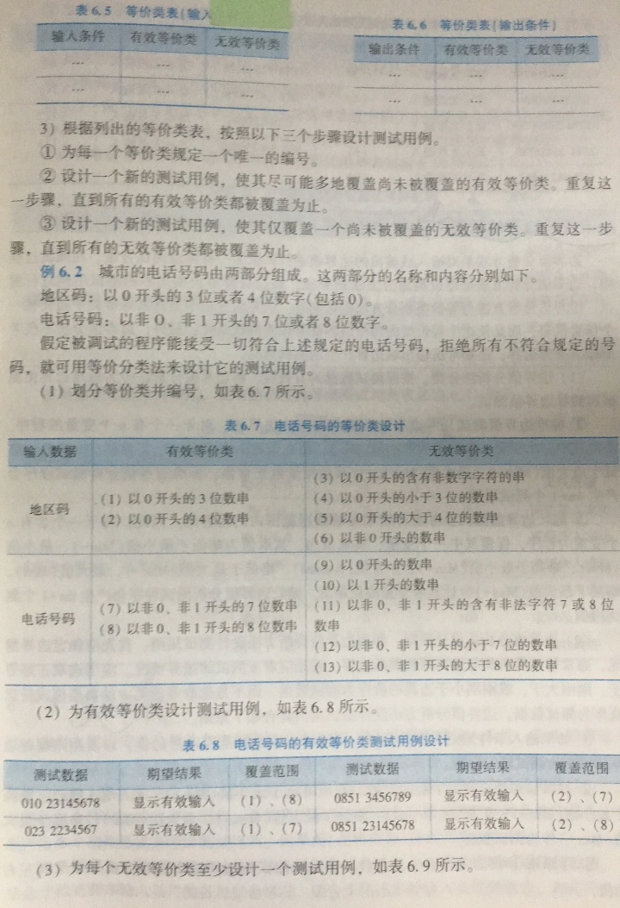

### 逻辑覆盖

<pre>
<code>
逻辑覆盖分为：
1.语句覆盖
2.判定覆盖(分支覆盖)
3.条件覆盖
4.判定-条件覆盖(分之-条件覆盖)
5.条件组合覆盖
6.路径覆盖
</code></pre>

### 面向对象的基本概念

<pre>
<code>
1.对象
    对象时客观存在，要研究的事物
2.类
    类是对具有相同属性和相同操作的一组相似对象的集合，对象的抽象是类，类的具化就是对象，也可以说类的实例是对象
3.消息
    软件对象通过相互间传递消息来相互作用和通信
4.方法
    方法就是对象能执行的操作
5.属性
6.封装
7.继承
8.多态性
    指相同的操作、函数或过程可作用于多种类型的对象上并获取不同的结果
9.重载
    函数重载和运算符重载
</code></pre>

### UML中常用图（归属表）

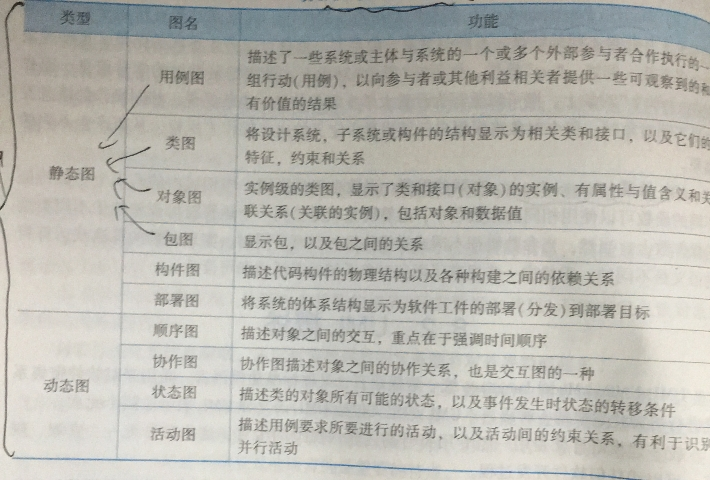

### UML用例图

<pre>
<code>
用例的组成：
1.系统边界
2.参与者
    参与者是与系统交互的人或物
3.用例
4.关系
    4.1 关联(association)
    4.2 包含(include)
    4.3 扩展(extend)
    4.4 泛化(generalization)
</code></pre>

### 活动图

<pre>
<code>
组成六要素：
1.活动
2.活动流
3.分支与合并
4.分叉与汇合
    用于将活动六分为两个或多个并发运行的分之
5.泳道
    每一个泳道代表一个责任区域，指明活动是由谁负责的或发起的
6.对象流

</code></pre>

### 包图

<code>
包与包之间允许建立依赖，泛化和细化等关系
</code>

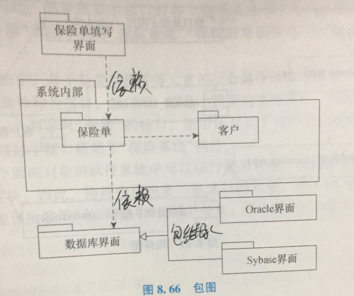

